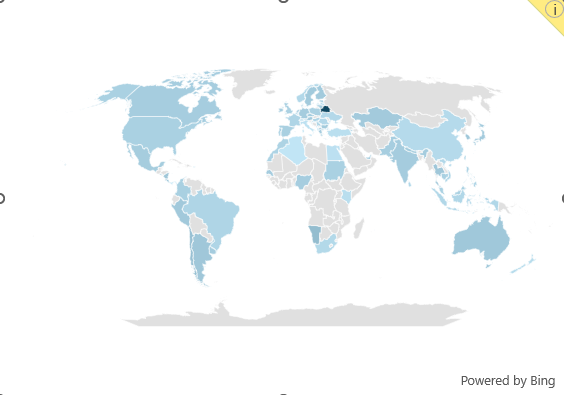

# 📊 Salary Dashboard – Excel Data Analytics Project

---

## 📌 Project Overview
The **Salary Dashboard** is an interactive Excel analytics project that visualizes salary trends across job roles, countries, and employment types. It provides **median salary insights, job counts, top hiring platforms, and geographic job distributions** using pivot tables, slicers, and charts.

This dashboard answers key questions:
- What’s the median salary by job title?
- How do salaries compare across employment types?
- Which countries have the most opportunities?
- What are the top job platforms?

---

## 📂 Project Structure

- **1_Salary_Dashboard.xlsx** → Main Excel dashboard file  
- **1_Salary_Dashboard.png** → Dashboard overview image  
- **1_Salary_Dashboard_Chart2.png** → Country distribution (map)  
- **1_Salary_Dashboard_Screenshot1.png** → Job title salaries chart  
- **1_Salary_Dashboard_Screenshot3.png** → Employment type filter  
- **1_Salary_Dashboard_Data_Validation.gif** → Interactive dropdown demo  
- **README.md** → Project documentation  

---

## 📸 Dashboard Walkthrough

### 🔹 1. Main Dashboard Overview
  
This is the **central view** of the dashboard:  
- Left: Median salary comparison across job roles  
- Middle: Geographic distribution of jobs (map)  
- Right: Employment type breakdown  
- Bottom KPIs: **Median Salary, Top Job Platform, Job Count**

---

### 🔹 2. Country Distribution (Map)
  
- Displays job availability across different countries.  
- Darker shades = more job postings.  
- Useful for global workforce insights.

---

### 🔹 3. Salary by Job Title
  
- Compares **median salaries** across different roles.  
- Key insight:  
  - **Senior Data Scientist** earns ~$155K.  
  - **Data Analyst** median salary is ~$90K.  
  - **Machine Learning Engineers** and **Senior Data Engineers** are among the highest paid.

---

### 🔹 4. Employment Type Filter
  
- Dropdown filter to view data by employment type:  
  - Full-time, Part-time, Contractor, Internship, Temp work  
- Updates all visuals dynamically based on selection.

---

### 🔹 5. Interactive Dropdown Demo
  
- Demonstrates Excel **Data Validation** in action.  
- Selecting job titles or types updates all related visuals instantly.

---

## 📊 Dataset Snapshot
Example of data used (from `1_Salary_Dashboard.xlsx`):

| Job Title             | Median Salary |
|-----------------------|---------------|
| Data Analyst          | $90,000       |
| Data Scientist        | $130,000      |
| Data Engineer         | $125,595      |
| Senior Data Scientist | $155,000      |
| Machine Learning Eng. | $150,000      |

The dataset includes:
- Job Title  
- Median Salary (USD)  
- Employment Type  
- Country  
- Job Count  
- Top Hiring Platform  

---

## 🚀 How to Use
1. Download **`1_Salary_Dashboard.xlsx`**.  
2. Open in **Microsoft Excel (2016 or later)**.  
3. Use **dropdowns and slicers** to filter by job title, country, and employment type.  
4. Hover over visuals for details and insights.  

---

## 🛠️ Tools & Techniques
- **Microsoft Excel**  
  - Pivot Tables & Charts  
  - Slicers  
  - Conditional Formatting  
  - Data Validation (Dropdowns)  
  - Power Query for data shaping  

- **Bing Maps Integration** for geographic job visualization.  

---

## 🎯 Key Insights
- Median salary for **Data Analyst**: **$90,000**  
- **Senior Data Scientist** & **Machine Learning Engineer** earn $150K+  
- Majority of roles are **Full-time** (~5,800+ job postings)  
- **Indeed** is the top job platform  

---

## 🤝 Contribution
Contributions are welcome!  
If you’d like to enhance this dashboard (add more insights, automate updates, or improve visuals):  
1. Fork this repository  
2. Create a branch (`feature-new-insight`)  
3. Commit your changes  
4. Open a Pull Request  

---

## 👩‍💻 About Me
Author: **Sneha**  
📩 Feel free to reach out for collaborations, suggestions, or feedback!  

---
